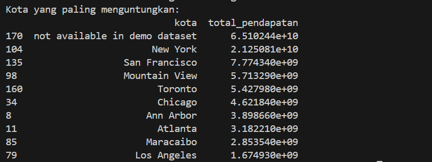

# Soal 1 - Data Transformation dan Analysis Case
1. Data
- data diambil dari file csv [ecommerce-session-bigquery.csv](ecommerce-session-bigquery.csv)
- menggunakan chatgpt sebagai asisten untuk meminta bantuan pembuatan code
    a. ekstrak data
    ``df = pd.read_csv('ecommerce-session-bigquery.csv')``
    b. mengganti nama kolom
    
    Promp yang di kirim ke chatgpt
    ```
    df['date'] = pd.to_datetime(df['date'])
    df.rename(columns={'date': 'Tanggal'})
    df.rename(columns={'v2ProductName': 'nama_produk'})
    df.rename(columns={'fullVisitorId': 'ID_pengunjung'})
    df.rename(columns={'totalTransactionRevenue': 'total_pendapatan'})
    df.rename(columns={'city': 'kota'})
    ```

    promp jawaban chatgpt
    ```
    df['date'] = pd.to_datetime(df['date'])
    df.rename(columns={'date': 'Tanggal',
                    'v2ProductName': 'nama_produk',
                    'fullVisitorId': 'ID_pengunjung',
                    'totalTransactionRevenue': 'total_pendapatan',
                    'city': 'kota'}, inplace=True)
    ```

    # analisis
1. identifikasi produk dengan pendapatan terbesar per hari

    Promp yang di kirim ke chatgpt
    ```
    total_pendapatan_per_hari = df.groupby(['Tanggal', 'nama_produk'])['total_pendapatan'].sum()
    produk_teratas_per_tanggal = df.groupby('Tanggal')['total_pendapatan'].sum()
    ```

    jawaban chatgpt
    ```
    total_pendapatan_per_hari = df.groupby(['Tanggal', 'nama_produk'])['total_pendapatan'].sum()

    produk_teratas_per_tanggal = total_pendapatan_per_hari.groupby('Tanggal').idxmax().apply(lambda           x:total_pendapatan_per_hari.loc[x])
    ```
    untuk melihat hasil perbaikan lengkapnya klik disini [analyst.py](analyst.py)
    jalankan file ini [analyst.py](analyst.py) untuk melihat hasilnya
    

    hasil : 
    - pendapatan tertinggi harian terjadi pada 2017-04-07 oleh produk ``YouTube RFID Journal`` dengan pendapatan yaitu ``$ 6.831.960.000``

2. analisis anomali
    untuk menentukan anomali transaksi kita perlu mengetahui standar deviasi transaksi dari setiap produk. standar deviasi adalah rata-rata transaksi per produk dikurang rata-rata transaksi keseluruhan. 

    produk yang memiliki standar deviasi paling tinggi dianggap sebagai anomali.
    rata2_transaksi_per_produk = sum(transaksi_per_produk)/n_transaksi
    rata2_transaksi_keseluruhan = sum(transaksi)/n_transaksi
    standar_deviasi = rata2_transaksi_per_produk - rata2_transaksi keseluruhan

    prompt yang saya kirim
    ```
    jumlah_transaksi_per_produk =df.groupby('nama_produk')['transactions'].sum()
    total_transaksi_per_produk =df.groupby('nama_produk')['transactions'].count()
    rata2_transaksi_per_produk = jumlah_transaksi_per_produk/total_transaksi_per_produk

    jumlah_transaksi = df['transactions'].sum()
    total_transaksi =df['transactions'].count()
    rata2_transaksi = jumlah_transaksi/total_transaksi

    n = len(rata2_transaksi_per_produk)
    variasi = ((rata2_transaksi_per_produk - rata2_transaksi) ** 2).sum() / (n - 1)
    std_deviasi_per_produk = np.sqrt(variasi)
    ```
    prompt jawaban chatgpt
    ```
    std_deviasi_per_produk = df.groupby('nama_produk')['transactions'].std()
    ```

menggunakan loop kita dapat memilih dan memasukkan data yang memiliki kriteria yang kita ingingkan 

```
    for produk_tertentu in produk_teratas.index:
        if produk_tertentu not in produk_tertambah:  
            df_produk_tertentu = df[df['nama_produk'] == produk_tertentu]

            mean_transactions = df_produk_tertentu['transactions'].mean()
            std_transactions = df_produk_tertentu['transactions'].std()
            threshold_upper = mean_transactions + 2 * std_transactions
            anomalies = df_produk_tertentu[df_produk_tertentu['transactions'] > threshold_upper]
            df_produk_tertentu = df_produk_tertentu.sort_values(by='Tanggal')


            if not anomalies.empty: 
                data_anomali = pd.concat([data_anomali, pd.DataFrame({'Nama Produk': [produk_tertentu],
                                                                    'Jumlah Transaksi': [anomalies['transactions'].iloc[0]]})],
                                                                    ignore_index=True)
                produk_tertambah.add(produk_tertentu)
```

untuk mengetahui 5 produk dengan standar diviasi tertinggi kita dapat melihatnya melalui grafik
```
    plt.figure(figsize=(10, 6))
    plt.plot(df_produk_tertentu['Tanggal'], df_produk_tertentu['transactions'], marker='o', linestyle='-')
    plt.title('Jumlah Transaksi untuk Produk: ' + produk_tertentu)
    plt.xlabel('Tanggal')
    plt.ylabel('Jumlah Transaksi')
    plt.xticks(rotation=45)
    plt.grid(True)
    plt.show()
```
untuk melihat hasil perbaikan lengkapnya klik disini [anomali.py](anomali.py)
jalankan file ini [anomali.py](anomali.py) untuk melihat hasilnya


3. analisis kota dengan pendapatan tertinggi

dari file [analyst.py](analyst.py) kita dapat mengimport data df yang sudah ditransformasi. dengan demikian kita dapat langsung menggunakan perintah :
```
total_pendapatan_per_kota = df.groupby('kota')['total_pendapatan'].sum().reset_index()
```
untuk melihat total pendapatan setiap kota.

dan perintah :
```
kota_teruntung = total_pendapatan_per_kota.sort_values(by='total_pendapatan', ascending=False)
```
untuk mengurutkan berdasarkan pendapatan tertinggi.

untuk melihat hasil perbaikan lengkapnya klik disini [kota_untung.py](kota_untung.py)
jalankan file ini [kota_untung.py](kota_untung.py) untuk melihat hasilnya
