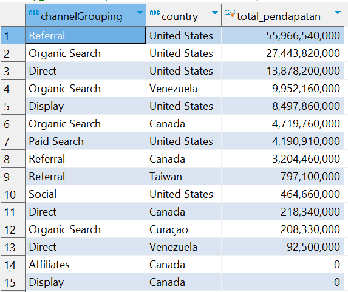
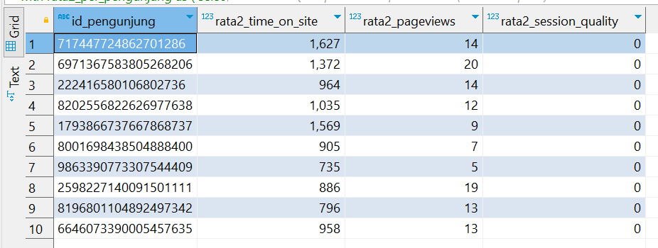
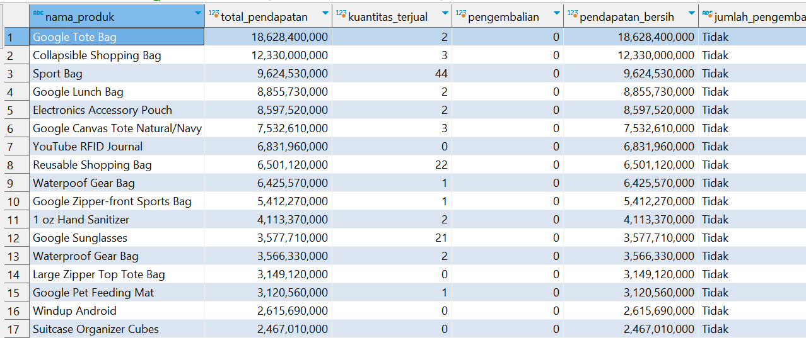

# Soal 4 -SQL Case

1. Persiapan
    - data diambil dari file csv [ecommerce-session-bigquery.csv](ecommerce-session-bigquery.csv)
    - extract dan transform data dilakukan menggunakan pandas
    - Load data ke PostgreSQL menggunakan sqlalchemy

sebelum menjalankan file ```ingest_to_postgreSQL.sql``` terlebih dahulu menjalankan ```docker-compose.yml```
hal ini untuk menjalankan kontainer postgreSQL di local computer yang dapat terhubung ke dbeaver.
Gunakan koneksi yang sama dengan yang ada di ```docker-compose.yml``` untuk dapat terhubung ke lingkungan docker kontainer. 

2. extract
    pastikan telah lingkungan dibawah ini dapat berjalan
    ```
    import pandas as pd
    from sqlalchemy import create_engine
    from sqlalchemy.types import String, DateTime, Integer, Float
    ```
    membuat fungsi untuk ekstrak data dari ```ecommerce-session-bigquery.csv```
    ```
    def get_dataframe():
    df = pd.read_csv("ecommerce-session-bigquery.csv", sep=",")
    return df
    ```
3. Manipulasi data
manipulasi dilakukan untuk mengatur data supaya dapat dibaca ketika di load ke postgreSQL. 
terdapat beberapa manipulasi yang dilakukan pada tahapan ini 

membuat fungsi untuk memanipulasi data
```
def get_manipulate_data(df):
```
Memastikan nilai kolom numerik tidak memiliki nilai null
```
    df['totalTransactionRevenue'] = df['totalTransactionRevenue'].fillna(0).astype(float)
    df['transactions'] = df['transactions'].fillna(0).astype(int)
    df['timeOnSite'] = df['timeOnSite'].fillna(0).astype(int)
    df['pageviews'] = df['pageviews'].fillna(0).astype(int)
    df['productRefundAmount'] = df['productRefundAmount'].fillna(0).astype(int)
    df['productQuantity'] = df['productQuantity'].fillna(0).astype(int)
    df['productPrice'] = df['productPrice'].fillna(0).astype(int)
    df['productRevenue'] = df['productRevenue'].fillna(0).astype(int)
    df['itemQuantity'] = df['itemQuantity'].fillna(0).astype(int)
    df['itemRevenue'] = df['itemRevenue'].fillna(0).astype(int)
    df['transactionRevenue'] = df['transactionRevenue'].fillna(0).astype(int)
    df['sessionQualityDim'] = df['sessionQualityDim'].fillna(0).astype(int)
```
Memastikan kolom tanggal memiliki tipe data yang sesuai
```
    df['time'] = pd.to_datetime(df['time'])
    df['date'] = pd.to_datetime(df['date'])
```
Mengubah tipe data kolom string
```
    string_columns = ['fullVisitorId','visitId', 'channelGrouping', 'country', 'city', 'sessionQualityDim',
                      'type', 'productSKU', 'v2ProductName', 'v2ProductCategory', 'productVariant',
                      'currencyCode', 'transactionId', 'pageTitle', 'searchKeyword', 'pagePathLevel1',
                      'eCommerceAction_type', 'eCommerceAction_step', 'eCommerceAction_option']
    for col in string_columns:
        df[col] = df[col].astype(str)
    return df
```
4. Menginisialisasi koneksi ke database PostgreSQL menggunakan SQLAlchemy
```
def get_postgres_conn():
    user = 'postgres'
    password = 'admin'
    host = 'localhost'
    database = 'mydb'
    port = 5432
    conn_string = f'postgresql://{user}:{password}@{host}:{port}/{database}'
    engine = create_engine(conn_string)
    return engine
```
Menyiapkan skema DataFrame dan memuatnya ke dalam database PostgreSQL
```
def load_to_postgres(engine, clean_data):
    df_schema = {
            'fullVisitorId': String,
            'channelGrouping': String,
            'time': DateTime,
            'country': String,
            ........
        }
```
mengatur type data
```
clean_data.to_sql(name='data_ecommerce', con=engine, if_exists='replace', index=False, schema='public', dtype=df_schema, method=None, chunksize=20000)
```
5. memanggil fungsi untuk membaca, manipulasi dan load data
```
df = get_dataframe()
clean_data = get_manipulate_data(df)
postgres_conn = get_postgres_conn()
load_to_postgres(postgres_conn, clean_data)
```
6. analisis 
# Beralih ke PostgreSQL
# Test Case 1 : Analisis Channel
analisa pendapatan setiap channelGrouping dari 5 negara pendapatan terbesar.
pada kasus ini kita perlu mengetahui 5 negara dengan pendapatan terbesar terlebih dahulu.
dengan menggunakan CTE kita bisa membuat table table tersebut

```
with top_countries as (
    select 
        country,
        SUM("totalTransactionRevenue") total_pendapatan
    from 
        public.data_ecommerce 	
    group by 
    	country 				
    order by 
    	total_pendapatan  		
    desc 				  		
    limit 5				  		
),
```
setelah itu kita juga perlu membuat table pendapatan setiap channel
dimana negara yang dimasukkan adalah kelima country diatas
```
total_pendapatan_per_channel as (	
    select							
        "channelGrouping",
        country,
        SUM("totalTransactionRevenue") total_pendapatan
    from 
        public.data_ecommerce
    where							
        country in (select country from top_countries)
    group by
        "channelGrouping",  
        country			    
)
```
selanjutnya kita perlu membuat table yang dikelompokkan oleh dua kolom yaitu ```channelGrouping``` dan ```country```
```
select 						
    "channelGrouping",		
    country,
    SUM(total_pendapatan) total_pendapatan
from 
    total_pendapatan_per_channel
group by 	
    "channelGrouping",  
    country
order by 					
    total_pendapatan desc
limit 15;

```
Hasil query : jalankan query ini [Test_Case_1_Analisis_Channel.sql](Test_Case_1_Analisis_Channel.sql)


hasil :
- channel referral dari United States adalah channel dengan pendapatan tertinggi yaitu ``$55.966.540.000``
- 5 negara dengan pendapatan tertinggi adalah United States ``United States, Venezuela, Canada, Taiwan, dan Curaçao``

# Test_Case_2_Analisis_Perilaku_Pengguna
untuk menganalisa perilaku pengunjung, kita perlu menganalisis dua subjek. 
1. analisa perilaku setiap pengunjung :
```
with rata2_per_pengunjung as ( 
    select
    	-- Menghitung rata-rata kunjungan setiap pengunjung
        "fullVisitorId" id_pengunjung,
        AVG("timeOnSite") rata2_time_on_site,
        AVG(pageviews) rata2_pageviews,
        AVG("sessionQualityDim") rata2_session_quality
    from 
        public.data_ecommerce
    group by
        id_pengunjung
),
```
2. analisa perilaku keseluruhan pengunjung
```
rata2_keseluruhan as (
    select
        AVG("timeOnSite") rata2_seluruh_time_on_site,
        AVG(pageviews) rata2_seluruh_pageviews,
        AVG("sessionQualityDim") rata2_session_quality
    from 
        public.data_ecommerce
)
```
untuk menampilkan perilaku pengunjung yang memiliki rata-rata time_on_site diatas rata-rata keseluruhan dan rata-rata pageviews dibawah keseluruhan maka kita perlu menggabungkan kedua CTE diatas.
```
select
    rp.id_pengunjung,
    rp.rata2_time_on_site,
    rp.rata2_pageviews,
    rp.rata2_session_quality
from 
    rata2_per_pengunjung rp
join
    rata2_keseluruhan rk on 1=1
where
    rp.rata2_time_on_site > rk.rata2_seluruh_time_on_site
    and rp.rata2_pageviews < rk.rata2_seluruh_pageviews
limit 10;
```
Hasil query :
jalankan query ini [Test_Case_2_Analisis_Perilaku_Pengguna.sql](Test_Case_2_Analisis_Perilaku_Pengguna.sql)


Hasil:
- pengunjung dengan ID ``717447724862701286`` adalah pengunjung yang menghabiskan lebih banyak waktu.
- rata2_seluruh_time_on_site adalah 699.4510	
- rata2_seluruh_pageviews adalah 22.1399. 
- terdapat 595 orang pengunjung.
# Test_Case_3_Performa_Produk

```
--- menghitung total pendapatan yang dihasilkan oleh setiap produk
select 
    "v2ProductName" nama_produk,
    SUM("totalTransactionRevenue") total_pendapatan,
    SUM("productQuantity") kuantitas_terjual,
    SUM("productRefundAmount") pengembalian,
    (SUM("totalTransactionRevenue") - SUM("productRefundAmount")) pendapatan_bersih,
    case 
	    --- mendefinikan pengembalian lebih besar dari 10%
        when SUM("productRefundAmount") > 0.1 * SUM("totalTransactionRevenue") 
        then 'Ya'									
        else 'Tidak'								
    end jumlah_pengembalian_lebih_dari_10_persen 	
from 
    public.data_ecommerce 							
group by 											
    "v2ProductName"
order by 											
    total_pendapatan desc;							

```
Hasil query :
jalankan query ini [Test_Case_3_Performa_Produk.sql](Test_Case_3_Performa_Produk.sql)

Hasil: 
- Google Tote Bag adalah produk dengan pendapatan terbesar yaitu sebesar $18.628.400.000
- Sport Bag	adalah produk dengan quantitas terjual terbanyak yaitu	44 produk
- tidak ada pengembalian
